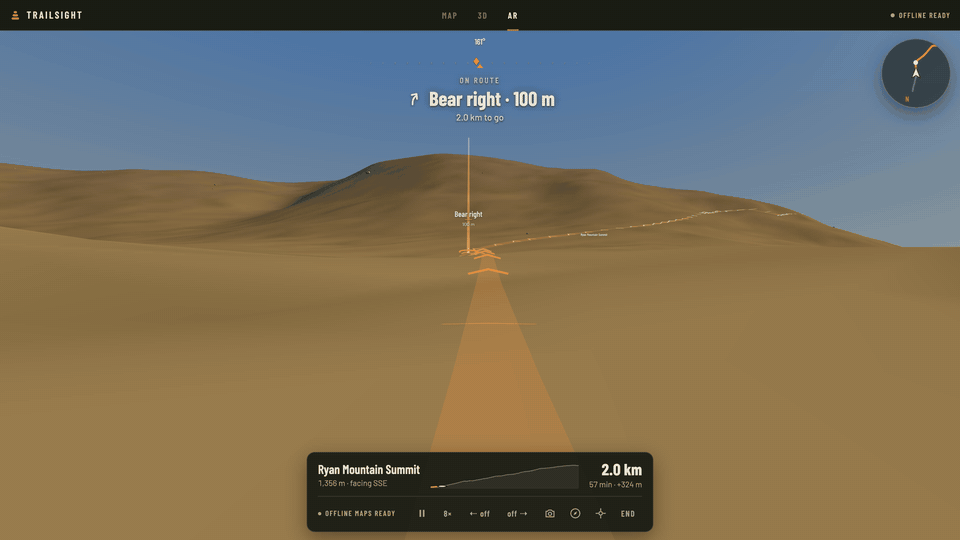
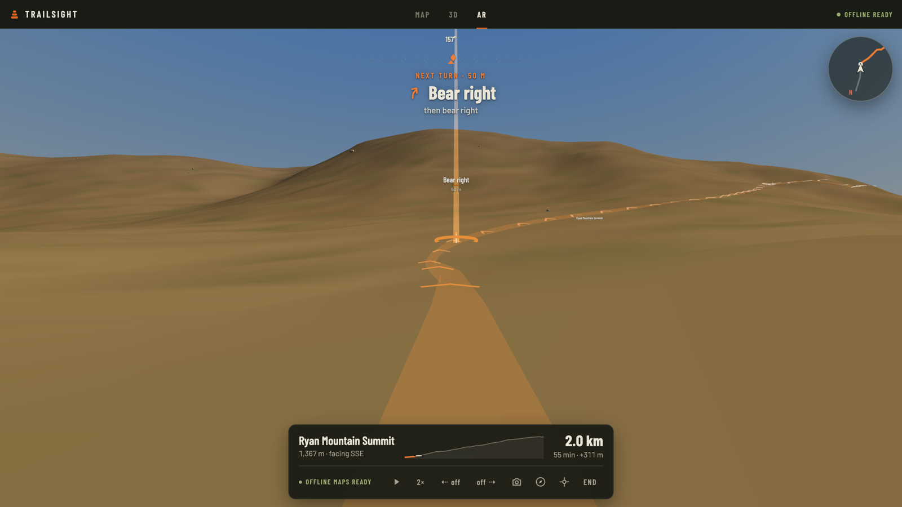
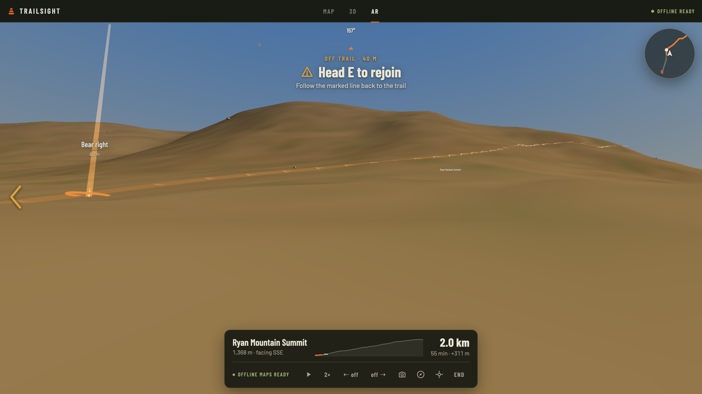
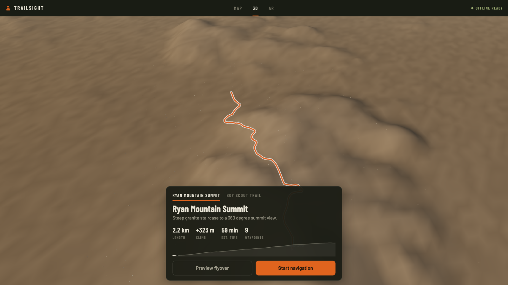
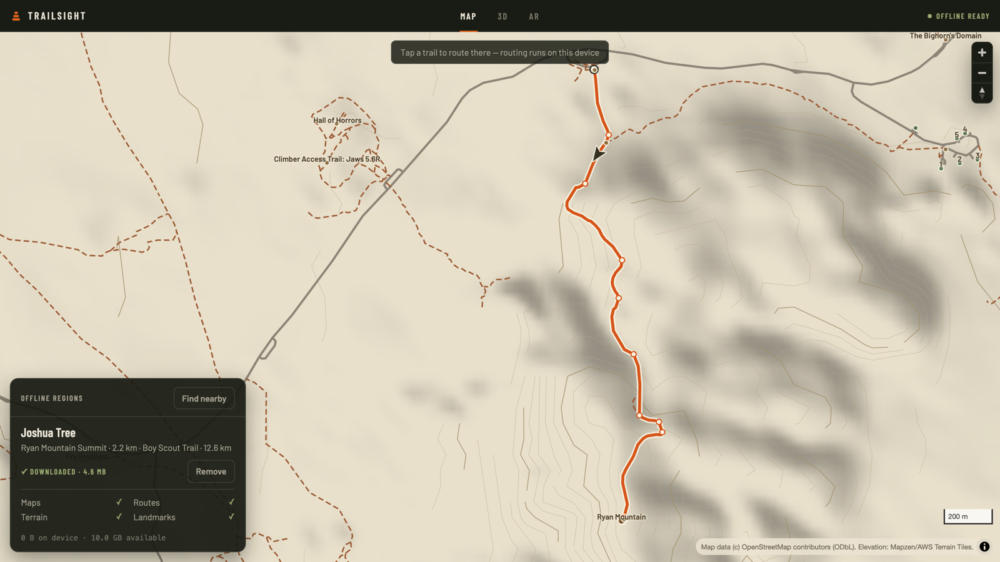

# TrailSight — Offline Spatial AR Navigation

**Offline-first spatial navigation for unfamiliar terrain, using AR guidance, OpenStreetMap data, and on-device sensor fusion.**

Live demo: **[sane24.github.io/Offline-AR-Maps](https://sane24.github.io/Offline-AR-Maps/)** · works in any desktop or mobile browser, no install.



## Overview

Traditional maps ask you to translate a 2D line into a real-world direction. On rocky trails,
backcountry washes, and open desert — places with no signage, no landmarks, and usually no
signal — that translation is exactly where people get lost.

TrailSight flips it: the route is drawn **into the world in front of you**. Chevrons hug the
ground along the next stretch of trail, a beacon marks the next turn with its distance, landmark
labels float where the landmarks actually are, and if you drift off the trail an amber line
points you back to it. Everything — maps, elevation, routes, landmarks — is stored on the
device, so it keeps working with the network fully off.

The demo region is Joshua Tree National Park: two real trails (Ryan Mountain Summit and the
notoriously easy-to-lose Boy Scout Trail), built from real OSM and elevation data. On a laptop,
a simulated walk moves you through the terrain and a rendered desert stands in for the camera;
on a phone, the live camera, compass, and GPS take over. The guidance stack is identical.

## Demo

| AR guidance | Off-route recovery |
| --- | --- |
|  |  |

| 3D route explorer | Offline topo map |
| --- | --- |
|  |  |

The demo tells one story in about a minute:

1. Pick a route in the 3D explorer (or preview it as a flyover).
2. Download the region — a checklist shows maps, routes, terrain, and landmarks stored locally.
3. Start navigation: the camera view shows the projected route, the next turn, and distance.
4. Drag to look away — the HUD tells you how far off-heading you are and which way to turn.
5. Press `A`/`D` to drift off the trail — off-route detection kicks in with a rejoin line.
6. Go offline (airplane mode or DevTools) — navigation, rerouting, and the map keep working.

## Key features

- **AR route guidance** — ground-hugging chevron flow, next-waypoint beacon with live distance,
  turn instructions, arrival detection, reorientation prompts when you face the wrong way
- **Offline-first region packs** — one download stores vector trails, POIs, contours,
  hillshade, and elevation grids in Cache Storage; a service worker keeps the app shell offline
- **3D terrain explorer** — the real DEM rendered with the route, waypoints and destination;
  orbit it or fly the route
- **Offline topo map** — MapLibre style served entirely from the region pack (hillshade,
  contours, trails, landmark labels), with the downloaded area outlined
- **On-device routing** — tap anywhere on the map and Dijkstra runs over the OSM trail graph
  locally, then synthesizes turn-by-turn waypoints from the geometry
- **Sensor fusion** — GPS watch + device orientation with smoothing, screen-rotation handling,
  a one-tap compass alignment, and a simulated-walk fallback so the demo works anywhere
- **Elevation everywhere** — climb remaining, elevation profile with live progress, hiking ETA
  that accounts for ascent, line-of-sight fading for landmark labels

## How it works

```
        OpenStreetMap (Overpass)      AWS/Mapzen Terrain Tiles
                  |                             |
                  v                             v
      data/build_region.py — stitch + resample routes, synthesize
      turn-by-turn waypoints, contours (marching squares), hillshade,
      int16 DEM grids, per-route high-res corridors
                  |
                  v
      Region pack: manifest.json + GeoJSON layers + terrain.bin
      + routes/*.json          (self-contained, plain static files)
                  |
                  v
             Offline store (Cache Storage + registry)
                  |
     +------------+------------+
     |            |            |
 Geolocation  Device        Camera
 (or sim)     orientation   (or rendered terrain)
     |            |            |
     +-----+------+-----+------+
           v            |
      Nav engine        |      snap to route, off-route hysteresis,
      (pure functions)  |      next waypoint, remaining climb, ETA
           |            |
           v            v
   One NavState/tick — consumed by every surface:
   AR overlay (Three.js) · HUD (compass tape, guidance, minimap)
   · 2D topo map (MapLibre) · 3D explorer
```

## Architecture

The web app is organized as small systems with clear seams, not framework layers:

```
web/src/
  app/         shell, zustand store, onboarding
  ar/          Three.js scene — terrain world, route overlay, HUD, camera rig
  maps/        MapLibre offline topo style + map view
  navigation/  pure nav engine: snapping, phases, guidance strings
  routing/     trail graph from OSM ways, Dijkstra, route synthesis
  offline/     region packs, download manager, Cache Storage registry
  sensors/     pose fusion (GPS / simulated walk / device orientation), camera feed
  terrain/     TER1 DEM decode, bilinear sampling, line of sight
  geo/         geodesy primitives — ENU local frame, bearings, haversine
  ui/          shared components, icons, formatting, theme
ios/           SwiftUI + ARKit scaffold, same pack format and nav semantics
data/          Python pipeline that builds region packs
```

A few decisions worth calling out:

- **The nav engine is pure.** `computeNav(route, pose, prev) -> NavState` runs every tick;
  AR, HUD, and map all render from the same result, so the views can never disagree. It is
  unit-tested (23 tests) together with the geometry, graph, and terrain modules.
- **AR anchoring is ENU-based.** The world lives in a local east-north-up frame anchored at
  the route start. Position + heading place the camera; content stays put. This works in
  backcountry where visual-positioning coverage doesn't exist.
- **Region packs over tile servers.** A region is a directory of static files with a manifest.
  Downloads are plain HTTP GETs streamed into Cache Storage with byte progress. The same pack
  is bundled into the iOS app.
- **The route must be unmistakable.** Navigation content (route line, chevrons, markers) is
  exempt from atmospheric fog, and the map-scale route is drawn at constant pixel width — so
  it reads like a route on a paper map at any distance.
- **No remote fonts, glyphs, or tiles.** Map labels are HTML markers, AR labels are canvas
  sprites, fonts are bundled woff2. Every byte the app needs is in the build or in a pack.

## Offline architecture

```
first visit          service worker precaches the app shell
                     (HTML, JS, CSS, fonts, icons)

"Download this       manifest.json fetched, then every file streamed
 area"               into a per-region cache ("region:joshua-tree")
                     with byte-accurate progress; a localStorage
                     registry records what is stored

offline              navigations -> cached shell
                     region reads -> cache-first across all caches
                     routing, nav, terrain -> already pure local code

updates              packs are versioned in the manifest; the registry
                     tracks the stored version per region
```

PMTiles support is wired through the stack for larger regions — generate a `basemap.pmtiles`
with [Planetiler](https://github.com/onthegomap/planetiler) and drop it into a region
directory; the web app registers the PMTiles protocol.

## Tech stack

`React` · `TypeScript` · `Vite` · `Three.js` · `MapLibre GL JS` · `zustand` ·
`OpenStreetMap` · `PMTiles` · `GeoJSON` · `Service Worker` · `Cache Storage` ·
`Web Sensors (geolocation / deviceorientation)` · `getUserMedia` · `Python` (data pipeline:
`requests`, `numpy`, `Pillow`) · `SwiftUI + ARKit` (iOS scaffold) · `vitest`

## Engineering challenges

- **Compass truth.** Device headings drift and differ across platforms (iOS
  `webkitCompassHeading` vs Android `alpha`), and rotate with the screen. The pose controller
  normalizes both, smooths with shortest-arc interpolation, and offers a one-tap "align to
  trail" calibration for the field.
- **Geographic → AR space.** Route coordinates become meters in a local ENU frame; elevation
  comes from a decoded int16 DEM sampled bilinearly (mercator-spaced rows), so chevrons
  actually sit on the ground instead of floating.
- **Off-route that doesn't flap.** Perpendicular distance to a polyline with enter/exit
  hysteresis (35 m / 18 m), plus a rejoin point projected slightly ahead so you're guided
  forward, not backward.
- **One state, three surfaces.** Map, HUD, and AR consume the same `NavState` per tick;
  keeping derived state out of components is what keeps them in sync.
- **Guidance without clutter.** The camera view holds a handful of elements — tape, one
  instruction, route, beacon — and everything else earns its place: landmark labels fade when
  terrain blocks line of sight, distant chevrons dissolve into the haze.
- **Offline byte-accounting.** Streaming downloads into Cache Storage with real progress,
  a registry that survives reloads, and a shell precache built from the actual Vite output.

## Run it locally

Requires Node 18+.

```bash
cd web
npm install
npm run dev        # dev server
npm test           # unit tests
npm run build && npm run preview   # production build (enables the service worker)
```

Useful demo controls in AR: `space` pauses the walk, `A`/`D` drift off the trail to trigger
off-route guidance, the speed chip cycles 1–8×.

### On a phone

Camera and motion sensors need a secure context. On your LAN:

```bash
npm run dev:https   # self-signed cert via @vitejs/plugin-basic-ssl
```

Open `https://<your-ip>:5199`, accept the certificate, then in AR enable the camera, compass,
and (if you're actually there) GPS from the bottom controls.

### Verifying the offline story

1. Run the production build (`npm run build && npm run preview`).
2. Download the region from onboarding or the map panel.
3. DevTools → Network → "Offline" → reload.

The shell comes back from the service worker, the region loads from Cache Storage, and
navigation, rerouting, and the topo map keep working. Check `caches`: `trailsight-shell-v1`
and `region:joshua-tree`.

## Rebuilding the data (optional)

The generated Joshua Tree pack (~4.6 MB) is committed so the demo runs immediately. To change
regions or refresh data:

```bash
pip3 install requests pillow numpy
python3 data/build_region.py     # ~2 min; Overpass + tile fetches cached in data/cache
python3 data/make_icons.py       # regenerates PWA icons
```

Edit the `REGION` dict at the top of `build_region.py`: bbox, OSM trail names, preferred
trailheads.

## iOS app

`ios/` contains a SwiftUI + ARKit scaffold that consumes the exact same region packs and ports
the nav engine with the same constants — see [ios/README.md](ios/README.md). Planned next:
MapLibre Native for the map tab, terrain-aware and elevation-aware routing costs, and visual
localization (on-device perception for re-anchoring when GPS is poor).

## Safety

TrailSight is a navigation aid, not a substitute for preparation. Carry a paper map and
compass in real backcountry, tell someone where you're going, and treat batteries as
consumable.

## Data attribution

- Map data © [OpenStreetMap](https://www.openstreetmap.org/copyright) contributors (ODbL).
- Elevation from [Mapzen/AWS Terrain Tiles](https://registry.opendata.aws/terrain-tiles/)
  (public-domain sources incl. SRTM and NED).

Code is MIT licensed — see [LICENSE](LICENSE).
